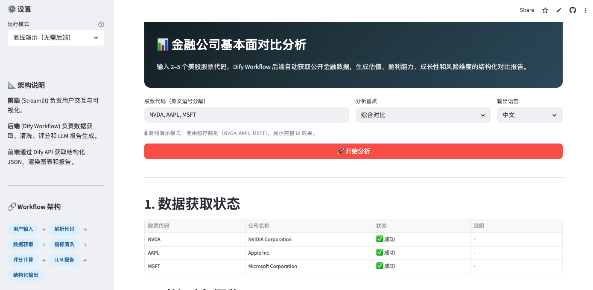
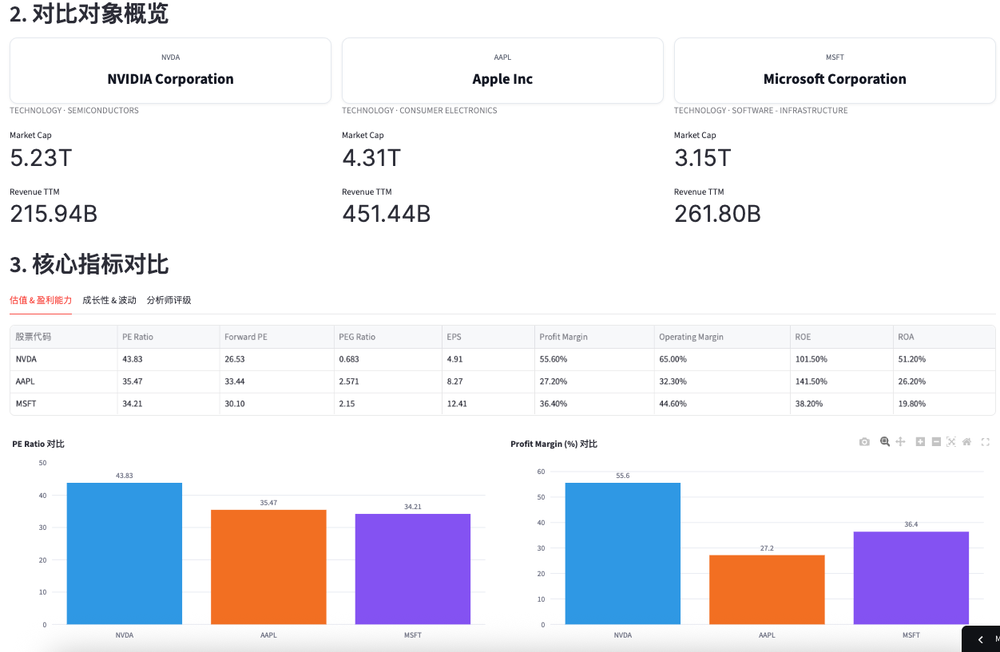
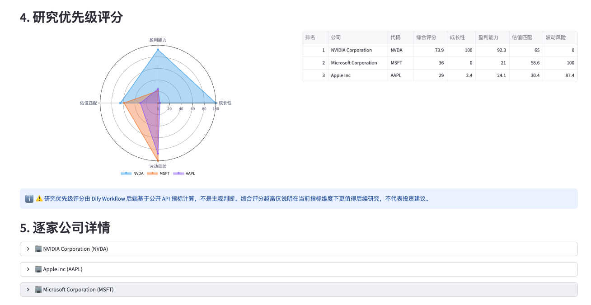
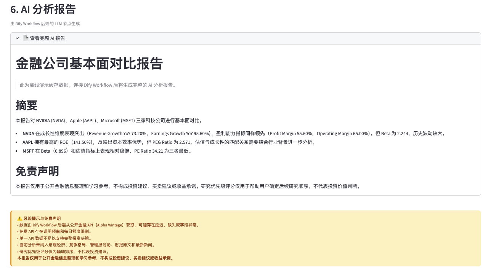
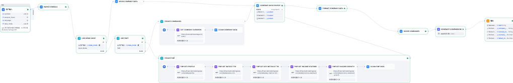

# Financial Company Comparison Agent

基于 Streamlit 与 Dify Workflow 的金融公司基本面对比分析助手。用户输入 2-5 个美股股票代码后，系统会获取公开金融数据，清洗关键指标，并生成覆盖估值、盈利能力、成长性、风险和分析师评级的结构化对比报告。

> 本项目定位为金融数据分析与 AI Agent 工作流作品集项目，重点展示「前端可视化 + 后端工作流编排 + LLM 报告生成」的完整产品闭环。内容仅用于公开信息整理和学习参考，不构成投资建议。

产品需求与方案长文见 [docs/](docs/)（含 [PRD](docs/PRD.md)、[Dify 产品设计](docs/dify-product-design.md)）。

## 项目亮点

- **端到端 AI 工作流**：通过 Dify Workflow 串联股票代码解析、金融 API 调用、数据清洗、评分计算与 LLM 报告生成。
- **作品集友好的离线演示**：即使没有 Dify 或外部 API Key，也可以使用内置缓存数据完整展示 UI、图表和分析报告。
- **结构化金融分析框架**：围绕估值、盈利能力、成长性、波动风险和分析师评级构建可解释的对比维度。
- **前后端职责清晰**：Streamlit 只负责交互与可视化，数据获取、清洗、评分和文本生成由 Dify 后端完成。
- **可扩展数据源设计**：Workflow 支持 Demo Mode、Alpha Vantage 和 Financial Modeling Prep，便于后续替换或扩展数据源。

## 产品截图

将截图导出为 PNG 或 WebP，放入 **`docs/images/`** 目录（与下方文件名一致即可；GitHub README 会自动渲染相对路径图片）。当前仓库已包含一套与下表同名的示例图，可直接 `git push`；若你更新了界面，覆盖同名文件即可。

| 建议文件名 | 内容说明 |
|-----------|----------|
| `streamlit-home-sidebar.png` | 首页股票输入、运行模式与侧边栏 |
| `streamlit-core-metrics.png` | 核心指标对比图表（柱状图 / 堆叠图等） |
| `streamlit-radar-scores.png` | 研究优先级雷达图与评分表 |
| `streamlit-ai-report.png` | AI 分析报告展开区域 |
| `dify-workflow-canvas.png` | Dify Workflow 编排画布（推荐提交裁剪后的 PNG；若从 Dify 导出超大内联 SVG，可本地保存为 `dify-workflow-canvas.source.svg`，该文件已在 `.gitignore` 中忽略，勿推送到远程） |

把文件放到仓库后，在 README 中可使用下面片段（路径已按上表写好；若你改用 WebP，把扩展名改为 `.webp` 即可）：

```markdown
### Streamlit 界面









### Dify 工作流


```

你也可以把多张图并排成一行（同一行内多个 ``），例如：

```markdown


```

### 嵌入版（README 直接展示）

下列图片路径与上表一致，已与文档一并维护；替换 `docs/images/` 下同名 PNG 后推送即可更新展示。

### Streamlit 界面


### Dify 工作流


## 功能概览

### 1. 多公司输入与运行模式

用户可以输入多个美股股票代码，例如：

```text
NVDA, AAPL, MSFT
```

应用支持两种运行方式：

- **离线演示模式**：使用内置缓存数据，适合作品集展示和无后端环境演示。
- **Dify API 模式**：调用运行中的 Dify Workflow，获取实时或后端处理后的结构化数据。

### 2. 数据获取状态

系统会展示每个股票代码的数据获取结果，包括成功、失败和错误说明，避免用户在数据缺失时误读分析结果。

### 3. 公司概览

展示公司名称、行业、板块、市值、TTM 收入等基础信息，帮助用户快速确认对比对象。

### 4. 核心指标对比

应用将核心指标拆分为多个分析视角：

- **估值与盈利能力**：PE Ratio、Forward PE、PEG Ratio、EPS、Profit Margin、Operating Margin、ROE、ROA
- **成长性与波动**：Revenue Growth YoY、Earnings Growth YoY、52 Week High、52 Week Low、Beta
- **分析师评级**：Strong Buy、Buy、Hold、Sell、Strong Sell 分布

### 5. 研究优先级评分

Dify Workflow 根据公开数据生成维度评分：

- 成长性评分
- 盈利能力评分
- 估值匹配评分
- 波动风险评分
- 综合评分

评分用于辅助确定后续研究优先级，不代表投资建议。

### 6. AI 分析报告

LLM 节点会基于结构化金融数据生成自然语言报告，支持按照用户选择的分析重点输出，例如综合对比、估值分析、盈利能力分析、成长性分析或风险分析。

## 技术架构

```text
用户输入股票代码
        |
        v
Streamlit 前端
        |
        | Dify Workflow API
        v
Dify Workflow 后端
        |
        +-- 解析股票代码
        +-- 判断数据模式
        +-- 调用 Demo / Alpha Vantage / FMP 数据源
        +-- 清洗公司基本面指标
        +-- 计算研究优先级评分
        +-- 调用 LLM 生成对比报告
        |
        v
结构化 JSON + Markdown 报告
        |
        v
Streamlit 可视化展示
```

## 技术栈

- **Python**：核心开发语言
- **Streamlit**：交互式数据应用前端
- **Plotly**：雷达图、柱状图与堆叠图可视化
- **Pandas**：表格数据组织与展示
- **Requests**：调用 Dify Workflow API
- **Dify Workflow**：后端工作流编排、API 调用、数据清洗、评分与 LLM 报告生成
- **Alpha Vantage / Financial Modeling Prep**：公开金融数据源

## 项目结构

```text
.
├── app.py                 # Streamlit 应用入口
├── requirements.txt       # Python 依赖
├── README.md              # 本说明
├── .streamlit/
│   └── secrets.toml.example   # Secrets 模板（复制为 secrets.toml，勿提交密钥）
├── workflow/
│   └── dify-workflow-export.yml   # Dify Workflow 导出（导入 Dify 复现后端）
└── docs/
    ├── README.md          # 文档索引
    ├── PRD.md             # 产品需求文档
    ├── dify-product-design.md     # Dify 与产品设计说明
    ├── images/            # README 产品截图（*.png；大体积 *.source.svg 见 .gitignore）
    └── samples/reports/   # 示例报告
```

- `app.py`：Streamlit 前端入口，负责页面布局、API 调用、图表和报告渲染。
- `requirements.txt`：Python 依赖列表。
- `workflow/dify-workflow-export.yml`：Dify Workflow 导出文件，可导入 Dify 复现后端工作流。
- `docs/PRD.md`：产品需求文档。
- `docs/dify-product-design.md`：Dify 工作流与产品设计长文，便于面试/作品集讲清方案。

## 本地运行

### 1. 创建虚拟环境

```bash
python -m venv .venv
source .venv/bin/activate
```

### 2. 安装依赖

```bash
pip install -r requirements.txt
```

### 3. 启动应用

```bash
streamlit run app.py
```

启动后，浏览器会打开 Streamlit 页面。默认可以选择「离线演示（无需后端）」模式查看完整效果。

## 公开部署（给他人一个链接用你的 Dify）

目标：**别人只打开网页、不填你的 API Key**，由部署环境代你调用 Dify。

### 1. 前提：Dify 必须能从公网访问

Streamlit 部署在云端后，会向你填写的 `DIFY_API_URL` 发 HTTP 请求。若 Dify 只跑在你本机 `localhost`，云端应用**连不上**。你需要任选其一：

- 使用 **Dify 官方云**或已公网可访问的自建实例；或  
- 自建 Dify 配好 **HTTPS + 域名**（或内网穿透仅作演示，注意安全与费用）。

### 2. 把密钥放在服务器侧（不要写进代码、不要提交 Git）

任选一种配置方式（同时提供 `DIFY_API_URL` 与 `DIFY_API_KEY` 即可）：

| 方式 | 说明 |
|------|------|
| 环境变量 | 启动前设置 `DIFY_API_URL`、`DIFY_API_KEY`（Docker / VPS / PaaS 均支持） |
| Streamlit Secrets | 本地：复制 `.streamlit/secrets.toml.example` 为 `.streamlit/secrets.toml` 并填写；**Streamlit Community Cloud**：App → Settings → Secrets，粘贴同名 TOML |

配置成功后，在应用里选择 **「Dify API」** 时会出现 **「部署模式：已使用服务器上的 Dify 配置」**，访客无需再填 Key。

### 3. 托管 Streamlit 应用

常见做法：**把本仓库推到 GitHub**，用 [Streamlit Community Cloud](https://streamlit.io/cloud) 连接仓库、指定 `app.py` 部署；在 Cloud 的 Secrets 里写入 `DIFY_API_URL` / `DIFY_API_KEY`。部署完成后把 `https://xxx.streamlit.app` 链接发给对方即可。

### 4. 安全与成本提示

- 公开链接等于任何人可触发你的 Workflow，可能消耗 **Dify / LLM / 外部金融 API** 额度；应在 Dify 侧做限流、鉴权或仅小范围分享链接。  
- 当前应用**未**内置登录；若要对指定客户开放，需另行增加鉴权（如 Streamlit 商业能力、反向代理 + SSO、或自建薄后端转发）。

## Dify Workflow 使用方式

如果需要使用真实后端模式：

1. 在 Dify 中导入 `workflow/dify-workflow-export.yml`。
2. 配置环境变量：
   - `ALPHA_VANTAGE_API_KEY`
   - `FMP_API_KEY`
3. 发布 Workflow 并获取 API Key。
4. 在 Streamlit 侧边栏选择 `Dify API`。
5. **本地调试**：填写 Dify Base URL 和 API Key。  
   **公开部署**：在服务器配置 `DIFY_API_URL` + `DIFY_API_KEY`（或 Streamlit Secrets），访客无需填写，见上文「公开部署」。
6. 选择数据源模式并开始分析。

## Dify API 输出约定

前端期望 Dify Workflow 返回以下结构化输出：

```json
{
  "company_data_json": "[...]",
  "scored_json": "[...]",
  "report_text": "Markdown report",
  "success_count": 3,
  "failed_count": 0
}
```

前端会将 `company_data_json` 和 `scored_json` 解析为 JSON，并用于表格、图表和评分模块渲染。

## 作品集展示建议

这个项目可以在作品集中突出以下能力：

- 将 AI Workflow 设计成可用的产品功能，而不是单次 Prompt 演示。
- 能够把非结构化的金融分析需求拆解为可解释的数据指标和评分模型。
- 能够设计离线演示模式，降低作品集评审和面试演示时的外部依赖风险。
- 具备前端交互、后端工作流、外部 API 集成和 LLM 输出控制的完整实现经验。

## 当前限制

- 免费金融数据 API 可能存在调用频率限制、字段缺失或数据延迟。
- 当前评分模型用于研究优先级排序，尚未经过投资回测验证。
- 分析结果未纳入宏观经济、管理层讨论、财报原文、实时新闻和行业竞争格局。
- Dify API 模式依赖外部服务稳定性和 API Key 配置。

## 后续规划

- 增加更多行业维度和同业基准比较。
- 支持导出 PDF 或 Markdown 分析报告。
- 引入财报原文、新闻摘要和管理层讨论分析。
- 增加评分权重配置，让用户按投资风格调整模型。
- 增加历史数据趋势图和估值区间分析。

## 免责声明

本项目仅用于公开金融信息整理、AI 工作流学习和作品集展示，不构成投资建议、买卖建议或收益承诺。任何投资决策都应结合更多信息并由用户自行承担风险。
